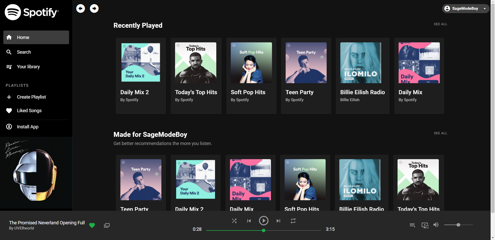

# spotify-clone


## Project description:

A challenge I did in order to test how far I came in learning Vuetify / Nuxt.

## Landing page screenshot:


## TODO: (This project is a UI only)

* [ ] Hook the app with the Spotify API.
* [ ] Add ability to store favorite songs playlists.
* [ ] Add authentication.

## Tools used: 
* Vue.js
* Vuetify
* Nuxt.js
* Visual Studio Code.

## Getting Started

```bash
# install dependencies
$ npm install

# serve with hot reload at localhost:3000
$ npm run dev

# build for production and launch server
$ npm run build
$ npm run start

# generate static project
$ npm run generate
```

For detailed explanation on how things work, check out [Nuxt.js docs](https://nuxtjs.org).

## Contribution:
Feel free to `fork` this project and add whatever you like. If you have any suggestions or any comments please feel free to contact me or to open an issue, use free license art assets please.

## Team:
[Jetlighters](https://github.com/JetLightStudio) having fun.

